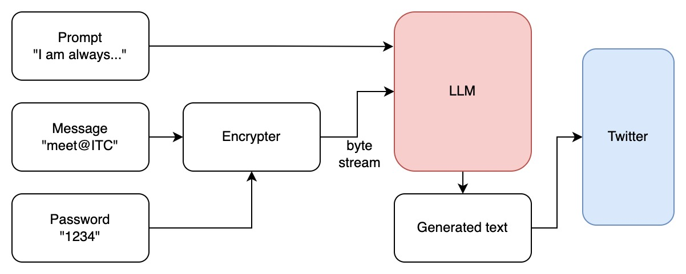

# SecretGPT: hiding messages on social media

Team: Edgar Kaziakhmedov, Eli Dworetzky



## Motivation

With the widespread use of social media and the adoption of generative AI technologies like ChatGPT, an intriguing opportunity for covert communication arises. Our project serves two purposes. First, SecretGPT is a proof of concept for concealing secret messages within innocent looking text generated by AI. Second, our project functions as a security audit, shedding light on the potential misuse of publicly available large language models (with publicly available APIs) by bad actors.

It is an ethical question whether large corporations like Google or the Government should store copies of users' encryption keys for public safety. In terms of detecting secret communication, it easy to tell if someone uses cryptography; the message will be a garbled string of characters. However, the method we demonstrate for secret communication (called steganography) allows the sender to hide the fact that secret communication is even occurring. In particular, the use of generative AI to do steganography by synthesizing text poses a potential threat to national security.

The project was done at [HackBU 2024 hackathon](https://devpost.com/software/secretgpt-hiding-messages-using-gpt-models) within 24 hours.

## What it does

SecretGPT takes a secret message specified by the user and encodes the information into the generated output of a large language model (LLM). The generated text is seemingly innocent and contextually unrelated to the secret it holds. We provide an example below:

**prompt**: ```I am always being asked if I like doing hackthons, but```

**secret**: ```meet@ITC```

**generated text (encoding)**:

```
I am always being asked if I like doing hackathons, but my honest opinion, no not really. 
The last two I did, one at a university, one with a company were both really great, 
the company had a great space with food / snacks and coffee 24 - hours and it felt great, 
I met some great folks, but at 4:45 in morning, when you're tired you want your sleep, not to be coding. 
So, I am not a huge hackathon guy but, I have a few tips on doing them, 
that will hopefully help. The most obvious tip, get a great idea. You can do this, 
you can come up, you can do it.
```

To demonstrate its real world application, we allow the user to post the generated text publicly on the [app's Twitter account](https://twitter.com/GptSecret56909). Anyone with an account can view the generated text, but the masses will not be able to tell that secret communication is occurring. Only the poster and the intended recipients know the presence of the secret. Any recipient with access to Twitter and a shared password can copy the Twitter post into SecretGPT's decoder to extract the message.

## Repository structure

```
project
|
└───encoder.py
|   Convert a string to an array of 2 bit (or 4 bit) integers used to index which tokens the LLM should use for text generation
└───encrypt.py
|   Implements AES in CBC mode
└───llm.py
|   Implements a class that interfaces LLM falcon-7b
└───twitter.py
|   Posts to Twitter account
└───frontend.py
    Implements basic frontend
```
